```mermaid
flowchart LR
    prd{{PRD}}
    mas{{MAS}}
    uarch{{uArch}}
    rtl(RTL)
    dv_testplan(DV testplan)
    dv_bringup(DV bring-up)
    dv_coverage(DV coverage)
    dv_signoff{{DV sign-off}}
    ppa(PPA)
    integration(Integration)
    prd --> mas --> uarch --> rtl --> dv_testplan --> dv_bringup --> dv_coverage --> dv_signoff --> ppa --> integration
    classDef todo fill:#e0e0e0,stroke:#9e9e9e,color:#333
    classDef in_progress fill:#bbdefb,stroke:#1976d2,color:#0d47a1
    classDef review fill:#ffe0b2,stroke:#f57c00,color:#e65100
    classDef done fill:#c8e6c9,stroke:#388e3c,color:#1b5e20
    classDef blocked fill:#ffcdd2,stroke:#d32f2f,color:#b71c1c
    class prd,mas,uarch,rtl,dv_testplan,dv_bringup,dv_coverage,dv_signoff,ppa,integration todo
```

# Hardware-flow progress

<!-- GENERATED from hw/STATUS.json by tools/hw/render_progress.py at 2026-08-26 05:06 UTC. Do not edit; update via tools/hw/status.py. -->
_Generated 2026-08-26 05:06 UTC from `hw/STATUS.json` — **do not edit**; see `hw/FLOW.md`._

## Stage flow

### `grape_pipeline`

### `huffman_engine`

### `mtf_cam`

Hexagon = checkpoint (human approval). Colours: grey todo, blue in progress, orange review, green done, red blocked.

## Module × stage

| Module | PRD | MAS | uArch | RTL | DV testplan | DV bring-up | DV coverage | DV sign-off | PPA | Integration |
|---|---|---|---|---|---|---|---|---|---|---|
| `grape_pipeline` | ⬜ | ⬜ | ⬜ | ⬜ | ⬜ | ⬜ | ⬜ | ⬜ | ⬜ | ⬜ |
| `huffman_engine` | ⬜ | ⬜ | ⬜ | ⬜ | ⬜ | ⬜ | ⬜ | ⬜ | ⬜ | ⬜ |
| `mtf_cam` | ⬜ | ⬜ | ⬜ | ⬜ | ⬜ | ⬜ | ⬜ | ⬜ | ⬜ | ⬜ |

⬜ todo · 🔵 in_progress · 🟠 review · ✅ done · ⛔ blocked

## Next up

- `grape_pipeline`: **PRD** — todo (checkpoint — needs human approval)
- `huffman_engine`: **PRD** — todo (checkpoint — needs human approval)
- `mtf_cam`: **PRD** — todo (checkpoint — needs human approval)

## Gates

### `grape_pipeline`

_No stage started yet._

### `huffman_engine`

_No stage started yet._

### `mtf_cam`

_No stage started yet._

## Metrics

| Module | Line cov % | Toggle cov % | Func cov % | Tests (pass/run) | Formal | Cells | Area µm² | Fmax MHz | Power mW |
|---|---|---|---|---|---|---|---|---|---|
| `grape_pipeline` | 0 | 0 | 0 | 0/0 | n/a | 0 | 0 | 0 | 0 |
| `huffman_engine` | 0 | 0 | 0 | 0/0 | n/a | 0 | 0 | 0 | 0 |
| `mtf_cam` | 0 | 0 | 0 | 0/0 | n/a | 0 | 0 | 0 | 0 |
