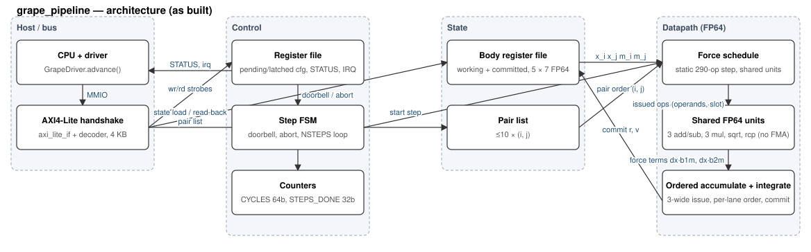
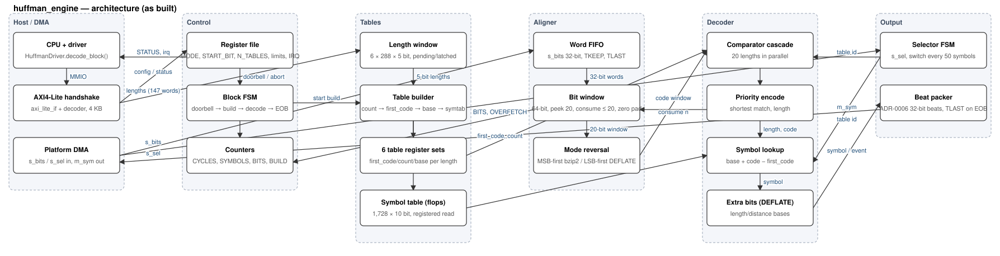
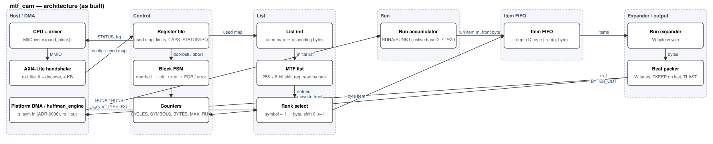

# Hardware Acceleration — Consolidated Report

*Standalone hardware writeup for the HWSW project. Self-contained: every quantitative
claim cites a file under `hw/` or `results/`. This document is the hardware companion to
`report_nbody` (grape) and `report_pyflate` (huffman + mtf); it is written to stand on its
own under grilling, so evidence stages are labeled explicitly and nothing is stated more
strongly than its source supports.*

**Path convention.** Inside a module chapter (§1–§3) a path such as `docs/ppa.md`, `rtl/…` or
`synth/evidence/…` is relative to that module's folder `hw/<module>/`; paths that start with
`hw/`, `report/`, `results/` or `research/` are from the repository root. Every cited file is
tracked in git (checked 2026-09-19); OpenLane run directories (`synth/runs/`) are *not*
tracked, so the small report files each number is read from are preserved in
`hw/<module>/synth/evidence/`.

Author: Yuval Kogan (hardware). Software benchmarks & report prose: Matan Cohen.
Date: 2026-09-19.

---

## 0. Scope and evidence discipline

*Terms used below.* **PRD / MAS / uArch**: the three specification documents each module has
under `docs/` — product requirements (KPIs), architecture specification (the external view: interfaces,
register map, driver API) and micro-architecture (the internal view: pipeline, FSMs, timing budget). **ADR**: architecture
decision record (`hw/docs/adr/`). **K1, K2, …**: a module's own numbered KPIs from its PRD — the
numbers are per module, so the text names the quantity each time. **STA**: static timing
analysis. **CTS**: clock-tree synthesis. **GDS**: the final routed layout file. **RF**: register
file. **L-vector**: the byte sequence the bzip2 symbol stage hands to inverse BWT.
**RUNA/RUNB**: bzip2's two run-length symbols. **Doorbell**: the control-register write that
starts a run. **W**: `mtf_cam`'s output width in bytes per beat. **symtab**: `huffman_engine`'s
symbol table.

Three accelerators were designed, verified and synthesized, each targeting the measured
hot boundary of one benchmark:

| Module | Benchmark | Offloaded boundary | Report |
|---|---|---|---|
| `grape_pipeline` | nbody | the whole `advance(dt, n)` integration kernel | `report_nbody` §5 |
| `huffman_engine` | pyflate (bzip2) | bit-reader + canonical-Huffman symbol decode | `report_pyflate` §5 |
| `mtf_cam` | pyflate (bzip2) | move-to-front + RUNA/RUNB run expansion | `report_pyflate` §5 |

`huffman_engine` → `mtf_cam` form the intended on-chip `pyflate_accel` chain producing the
same L-vector as the software symbol loop; `grape_pipeline` is standalone.

**How the numbers were produced (the flow).** Each accelerator is written in SystemVerilog and
simulated cycle by cycle (Verilator, cross-checked 4-state on Icarus) inside a Python
(cocotb/pyuvm) testbench that streams the real benchmark input and compares every output
against a frozen *golden model* — a Python reference of the same stage. Then **Yosys** synthesizes the RTL onto
**sky130** (SkyWater 130 nm open PDK, `sky130_fd_sc_hd` standard cells, tt 25 °C 1.8 V), and
**OpenLane 2 / OpenROAD** places the cells, builds the clock tree and runs static timing.

| Quantity | Produced by |
|---|---|
| Cycles per symbol/step, tests, coverage, formal | RTL simulation vs golden model; SymbiYosys |
| Cells, area | Yosys + sky130 Liberty (`make area`) |
| Fmax, power estimate | OpenLane place + CTS + STA (`*-stamidpnr*`) |

### 0.1 Toolchain — what we used, for which step, and why

Everything is open-source and version-pinned (`hw/setup.sh` installs it; `hw/env.sh` activates
it), so every hardware number in this project can be regenerated from the repository.

| Step | Tool (version) | Why this tool |
|---|---|---|
| Design language | **SystemVerilog**, synthesizable subset | required by the brief (Verilog / SystemVerilog / PyXHDL); subset chosen so the same source passes Verilator *and* Yosys |
| Lint | **Verilator 5.051** `--lint-only -Wall` | strictest free linter; width/latch/comb-loop errors caught before simulation |
| Simulation (main) | **Verilator 5.051** | compiles RTL to C++ — fast enough to run the *entire* benchmark input (150 k+ cycles, 20 000 nbody steps) per test; also produces line/toggle coverage |
| Simulation (cross-check) | **Icarus Verilog 14.0** | 4-state simulator: shows X-propagation after reset, which 2-state Verilator cannot |
| Testbench | **cocotb 2.0.1** + **pyuvm 4.0.1** + **cocotbext-axi 0.1.28** | the golden models are Python (the benchmark's own code), so a Python testbench calls them directly as the scoreboard oracle; pyuvm gives UVM structure (agents, sequences, scoreboard); cocotbext-axi supplies AXI4-Lite / AXI4-Stream bus models with back-pressure |
| Driver / unit tests | **pytest 9.1.1** | runs the register-map checks and the Python driver models without a simulator |
| Formal | **SymbiYosys v0.68** (SMT bounded model checking + k-induction) | proves control properties simulation can only sample: FSM arcs, stream handshakes, the move-to-front list invariants |
| Synthesis, area | **Yosys 0.68** + `sky130_fd_sc_hd` Liberty (tt, 25 °C, 1.8 V) | open synthesis; maps RTL to real standard cells → cell count and area |
| Process (PDK) | **SkyWater sky130**, high-density cell library | the only fully open 130 nm PDK with a complete tool flow — no NDA, so graders can reproduce; consequence: no SRAM macro was integrated in our flow (OpenRAM sky130 macros exist but were not evaluated), so all storage is flip-flops (this drives huffman's area) |
| Place, clock tree, timing, power | **OpenLane 2.3.10** (OpenROAD), via Nix | open RTL-to-layout flow; we use floorplan → placement → clock-tree synthesis → static timing + power estimate (post-CTS); routing/GDS not reached |
| Tool bundle | **OSS CAD Suite nightly 2026-08-26** | one pinned archive for Verilator, Icarus, Yosys, SymbiYosys, GTKWave → identical versions on any machine |
| Waveform debug | GTKWave / Surfer, `hw/common/tb/vcd2csv.py` | FST waves; CSV export so failures can be analysed in Python |
| Flow tracking, diagrams | `tools/hw/status.py`, `tools/hw/blockdiag.py` (ours) | stage-gate evidence in `hw/STATUS.json`; block diagrams generated from a JSON spec, no external renderer |
| AI assistance | Claude Code | drafting RTL, testbenches and documents inside the stage-gated flow (`hw/FLOW.md`) with human approval at every checkpoint; prompts logged in `prompt.txt` (brief §10) |

**Evidence-stage legend (used for every Fmax below).** OpenLane physical estimates come
at different depths of the flow, and they are *not* interchangeable. Per
`project_instructions.md §7` ("you are not expected to synthesize"), full GDS sign-off is
**bonus**, not required — the requirement is a trade-off discussion with a **defined
operating frequency**, which each module has.

| Stage tag | What it is | Optimism |
|---|---|---|
| **pre-placement STA** | STA on the synthesized netlist with an ideal clock network and estimated net RC | most optimistic; upper bound |
| **post-CTS STA** | STA after floorplan + placement + clock-tree synthesis (real placed clock tree) | closer to real; still no detailed-route RC |
| **GDS sign-off** | fully routed, DRC/LVS-clean | ground truth — **not reached** by any module |

No module reached GDS (no die shot). A post-CTS power estimate exists for all three —
`grape_pipeline` 19.2 mW, `huffman_engine` 283 mW, `mtf_cam` 13.7 mW — each with **default
switching activity** at its own run clock (150 / 40 / 20 ns): indicative only, not workload
power, and not comparable with each other.

---

## 1. grape_pipeline (nbody)

### 1.1 Hardware description
**What it is.** The name follows *GRAPE* ("GRAvity PipE"), the University of Tokyo family of
special-purpose N-body machines (GRAPE-1 1990 … GRAPE-6 2003): hard-wire the pairwise-force
formula as a pipeline, leave the rest to a host (`research/hw-algorithms-nbody.md §1`).
`grape_pipeline` keeps that idea and departs from it twice, both forced by the benchmark
(`hw/docs/adr/0002-grape-fp64-datapath-and-tolerance-oracle.md`): (1) **full IEEE-754 FP64 in the
benchmark's own operation order** — GRAPE's reduced-precision pairs (LNS/FP32-class, 1e-3…1e-6
force error) visibly diverge from the Python energy trace; (2) **the whole `advance()` runs
on-device** — body state stays on-chip for all 20,000 steps after one doorbell, where GRAPE
returned forces to a host integrator.

FP64 pairwise-gravity accelerator executing a full `advance(dt, n)` on-device. SystemVerilog:
`rtl/grape_pipeline.sv` (top), `rtl/grape_force_pipe.sv` (scheduled datapath),
`rtl/grape_accum.sv` (accumulate/integrate, parallel-prefix picker), `rtl/grape_step_fsm.sv`
(control), `rtl/fp64_*.sv` (add/mul/sqrt/rcp units). Single clock domain, synchronous `rst_n`.

### 1.2 Inputs / outputs, widths, frequency
- **I/O** (`docs/mas.md §2`): 32-bit AXI4-Lite slave exposing FP64 (binary64) body state,
  `DT` (FP64), `NSTEPS` (32-bit), pair configuration, control/status, counters, IRQ.
- **Operating frequency:** design target **50 MHz** (`docs/mas.md §2` clk row, `docs/prd.md` K-table).
  Achievable **≈ 19.46 MHz** — *post-CTS STA* on the parallel-prefix netlist
  (`docs/ppa.md` Addendum 2026-09-14; evidence `synth/evidence/ws.max.rpt`: +98.6212 ns setup
  slack @ 150 ns period → 51.38 ns).

### 1.3 Architecture
`docs/uarch.md`: three FP64 add/sub, three multipliers, one sqrt (radix-4 SRT), one
reciprocal (2¹⁰×20b ROM seed + Newton refinement in Q1.57), sharing a scheduled
**290-operation step**. An ordered accumulation sequencer resolves body-component
dependencies (pairs sharing a body serialize their velocity updates) before positions
commit; steps stay serial. There is no FMA — multiply and accumulate round separately
(matches the benchmark's `pow`-free arithmetic contract, `docs/testplan.md §4`).

### 1.4 HW/SW interface
- MMIO only, no DMA (`docs/mas.md §5`, ADR-0001). ≈ 150 AXI-Lite transactions per
  invocation (70 body + 10 pair + 4 config in; 60 state + 3 counter out), **once per
  20,000-step invocation** — < 0.03 % of compute (`docs/integration.md §1`).
- Driver model `driver/grape_pipeline_driver.py` verified register-for-register vs
  `docs/mas.md §4` (`driver/check_regmap.py` → **0 differences**) and against a
  full-invocation cycle model (`driver/test_driver.py` → 4/4 pass; 2,480,000 cycles =
  124 × 20,000).

### 1.5 Acceleration justification + estimate
- **Baseline** `T` = **231.20 ms** (pyperf mean; median 229 ms), `results/timing_distributions.txt:2` (231.204), rounded in `results/baseline_nbody_stats.txt`.
- **Fraction** `f` = 0.95 (`advance` doubly-nested loop, `docs/integration.md §3`).
- **HW cost** 2,480,000 cycles/invocation (K1 = **124** cyc/step, `docs/ppa.md`, measured
  bit-exact on the full 20,000-step benchmark).
- Amdahl `S = T / ((1−f)·T + t_hw)`:
  - **50 MHz** (target): t_hw = 49.6 ms → **3.78×** at f = 0.95 (4.45× at f = 0.99); the speedup KPI (≥ 4×) is not met at the stated `f`.
  - **19.46 MHz** (achievable): t_hw = 127.4 ms → **≈ 1.66×** (compute-only upper bound
    1.81× vs the original / 1.12× vs the 143.13 ms optimized-Python tier). Does **not** beat the
    9.53 ms native-software tier. (`docs/integration.md §3`.)
- **Bottom line vs the software tiers** (hardware rows are *projections*: RTL cycles ÷ STA
  clock + 5 % Python residual; software rows are VM measurements, `report_nbody` §1/§3):

  | Tier | Time / run | vs original |
  |---|---:|---:|
  | Original Python | 231.20 ms | 1.00× |
  | Optimized Python | 143.13 ms | 1.62× |
  | Native Rust | 9.53 ms | 24.26× |
  | **Hardware @ 19.46 MHz** | **≈ 139 ms** | **≈ 1.66×** |
  | Hardware @ 50 MHz (target) | ≈ 61 ms | ≈ 3.8× |

  The accelerator is level with optimized Python (1.03×) and ≈ 15× slower than native Rust
  (≈ 6× at target). Per step: 124 cycles = 6.4 µs at 19.46 MHz vs 0.48 µs natively; matching
  Rust needs ≈ 260 MHz, and the 11.6 ms Python residual alone already exceeds Rust's 9.53 ms.
  The benchmark's cost was interpreter overhead, so removing the interpreter captures nearly all
  of the gain; at N = 5 with ordered pair dependencies there is little parallelism to exploit.
- **Larger N (model projection, not RTL):** `docs/schedule_model_n.py` runs the same schedule model
  (123 modeled vs 124 measured cycles/step at N = 5) for N bodies. N = 5 is latency-bound at
  12.3 cycles/pair (one pair's chain is ≈ 80 cycles and ten pairs cannot fill it); at N = 100 the
  as-built units reach the unit-bound 4.36 cycles/pair = 0.224 µs/pair at 19.46 MHz — ≈ 4.4× faster
  than rolled Python (0.98 µs/pair) but 5.0× slower than native (0.045 µs/pair,
  `results/bigN_sweep.txt`). 12 add + 12 mul → 1.10 cycles/pair (1.25× slower than native);
  24 add + 24 mul + 2 sqrt + 2 rcp → 0.56 (1.6× faster). Upper bounds: they assume the clock
  survives wider issue selection (our 1-wide vs 3-wide data says it degrades), SRAM body state,
  and direct summation remaining the software competitor (Barnes-Hut wins above N ≈ 300).
- **Honest conclusion:** compute-bound; the end-to-end win is gated on timing closure, not
  the interface. The limiter is the integrate-multiplier operand path, whose pipelining is the
  documented next step.

### 1.6 Block diagram

Source `hw/grape_pipeline/docs/block_diagram.json` → `tools/hw/blockdiag.py` (as built: shared
scheduled FP64 units, no FMA). The report shows a condensed version (`report_nbody` Fig. 4
`report/fig/grape_report.svg`) and the ordering constraint (`report/fig/pair_dependency.svg`).

### 1.7 Performance / area / power trade-offs
`docs/ppa.md`. Yosys+sky130 area **4.075 mm² / 584,454 cells** (plain Yosys, synthesized before the final issue-selection rewrite that produced the 19.46 MHz netlist). The OpenLane synthesis that produced the timing maps the final RTL to **446,932 cells / 4.66 mm²** (5.65 mm² after buffering and clock tree, 39 % of the core); under that same recipe the pre-rewrite netlist was 4.92 mm², so the rewrite made the design 5 % smaller as well as 1.75× faster (`hw/grape_pipeline/synth/evidence/area_openlane.txt`). The two recipes are not comparable with each other. Measured 2-point trade-off (both points plain Yosys):

| Design point | Area | K1 cyc/step | Verdict |
|---|---:|---:|---|
| 1-wide accumulate, 1-port RF | 2.938 mm² | 162 | rejected (misses KPI) |
| **3-wide accumulate, 3-port RF** | **4.075 mm²** | **124** | **chosen** (+38.7 % area, −23.5 % cycles) |

Fmax **19.46 MHz** (post-CTS, parallel-prefix). Power **≈ 19.2 mW** post-CTS tool estimate
(default switching activity at the 150 ns run constraint — indicative, not workload power;
`docs/ppa.md`). Die shot: **not obtained** (OpenLane died in global routing, GRT-0607; not
§7-required, not invented).

---

## 2. huffman_engine (pyflate)

### 2.1 Hardware description
bzip2/DEFLATE canonical-Huffman decoder. SystemVerilog: `rtl/huffman_engine.sv` (top) plus, in the same `rtl/` folder,
`huff_aligner` (64-bit window + barrel shifter + FIFO), `huff_builder` (canonical table
build), `huff_decoder` (20-wide comparator cascade + priority encode), `huff_tables`
(symtab + 6 table register sets), `huff_regs` (length window + counters), `huff_selector`
(50-symbol table switch), `huff_ctrl`, `huff_deflate`, `huff_out`. Single clock, `rst_n`.

### 2.2 Inputs / outputs, widths, frequency
- **I/O:** 32-bit compressed stream + 8-bit selector stream in; 32-bit beats out carrying a
  9-bit symbol + type fields (`docs/mas.md §2`). 32-bit AXI4-Lite window holds `START_BIT`,
  lengths, counters for six tables and bzip2's 20-bit max code length.
- **Operating frequency:** target **50 MHz** (clock KPI, `docs/prd.md` K-table). Achievable
  **≈ 39.9 MHz** — *post-CTS STA* at a 40 ns constraint: worst setup slack +14.941 ns →
  25.06 ns achievable; no setup or hold violations (evidence preserved in
  `hw/huffman_engine/synth/evidence/`; a tighter 27 ns run also meets timing and gives 39.5 MHz, a looser 120 ns run 31.7 MHz).
  The pre-placement estimate of the first 20 ns run is superseded (`docs/ppa.md §3`).

### 2.3 Architecture
`docs/uarch.md`: a bit aligner feeds a canonical-code comparator/lookup datapath; a selector
controller changes the active table every 50 symbols with a **0-cycle switch** (six table
register sets pre-loaded). Decodes 1 symbol/cycle.

### 2.4 HW/SW interface
- Software parses each bzip2 block header and calls `HuffmanDriver.decode_block()` over a
  4 KB AXI4-Lite window; compressed bytes + selectors streamed by DMA (`docs/mas.md §5/§6`).
- Driver model `driver/huffman_engine_driver.py`, verified vs register map (0 diffs) and the
  signed-off cycle model (`docs/integration.md §1`).

### 2.5 Acceleration justification + estimate
- **Baseline** `T` = **1,123.49 ms** (≈ 1.12 s mean; median 1.12 s), `results/timing_distributions.txt:6` (1123.488), rounded in `results/baseline_pyflate_stats.txt:18`.
- **Fraction** `f` = **0.496** (Huffman decode 12.0 % + bit reader 37.6 %, `docs/prd.md §1`).
- **HW cost** 149,276 cycles for 148,271 symbols → **K1 = 1.0068** cyc/sym, trace-exact vs
  golden over every beat (`docs/ppa.md`, `docs/uarch.md §7`).
- Amdahl (residual 50.4 % of T = **566.2 ms**):
  - **50 MHz:** t_hw = 2.99 ms → **≈ 1.97×** (essentially the 1.98× ideal bound).
  - **39.9 MHz** (achievable, post-CTS): t_hw = 3.74 ms → **≈ 1.97×**.
- **Key finding — clock-insensitive.** Unlike grape, huffman is **Amdahl-fraction-bound,
  not clock-bound**: S stays **1.89–1.97×** across a 10× clock range (even 5 MHz → 1.89×),
  because the software Huffman path is ~566 ms and the hardware decode is milliseconds. The
  realized clock does not gate the result; `f` does (`docs/integration.md §3`).

### 2.6 Block diagram

Source `hw/huffman_engine/docs/block_diagram.json` (as built: symbol table in flops). System
view of the chain: `report_pyflate` fig `report/fig/decode_report.svg`.

### 2.7 Performance / area / power trade-offs
`docs/ppa.md`. Yosys+sky130 **1.634 mm² / 151,058 cells**, **54.44 % sequential** — the
design is a *memory*, not a datapath (`huff_tables` + `huff_regs` = 95 % of area, the
decode comparator cascade only 1.3 %). Soft K5 ceiling 1.0 mm² **missed by 1.63×**, a storage
miss: ~34 kbit of flops (no SRAM macro was integrated in our flow; OpenRAM sky130 macros exist but were not evaluated). Documented area path:
move the 17.3 kbit symtab + 8.6 kbit length window into SRAM macros → projected ~0.75 mm²
std cells + 2 macros (**not synthesized**). Fmax **39.9 MHz** (post-CTS, 40 ns constraint).
Power **≈ 283 mW** post-CTS (default switching activity at the 40 ns constraint — indicative,
scales with clock, not workload power). Die shot: not obtained.

---

## 3. mtf_cam (pyflate)

### 3.1 Hardware description
Move-to-front + RUNA/RUNB run-expansion engine. SystemVerilog: `rtl/mtf_cam.sv` (top) plus, in the same `rtl/` folder,
`mtf_list` (256-entry move-to-front list, a parallel shift register read by rank), `mtf_ctrl` (invocation/init-fill FSM), `mtf_run`
(RLE counter), `mtf_expand` (run→byte), `mtf_pack` (W-lane packer), `item_fifo`, `mtf_regs`.
Single clock, `rst_n`.

### 3.2 Inputs / outputs, widths, frequency
- **I/O:** input is a *rank*; the decoder indexes the alphabet, shifts preceding entries, and
  expands RUNA/RUNB groups through a buffered output packer **8 bytes wide**. Interfaces
  (`docs/mas.md §2`): 32-bit AXI4-Lite control/status window; 32-bit AXI4-Stream symbol beats in
  (`s_axis_sym`, TLAST on the end-of-block beat); 64-bit (8·W, W = 8) AXI4-Stream out
  (`m_axis_l`) with 8-bit TKEEP and TLAST; 1-bit interrupt.
- **Operating frequency:** target **50 MHz** (uArch §6). Achievable **≈ 37.6 MHz** —
  *post-CTS STA* (tt, evidence `synth/evidence/ws.max.rpt`: −6.5964 ns setup slack @ 20 ns →
  26.60 ns). This is the **tightest-constrained** measurement of the three (the constraint is
  within 1.33× of the result, so the tool optimised the critical path hard). Missed 50 MHz by
  ~1.33×.

### 3.3 Architecture
`docs/uarch.md`: a 256×8 shift-register CAM with a 256:1 rank read-mux and a parallel
registered move-to-front shift (every entry writable each cycle, so no RAM). Run expansion
feeds a W=8-lane packer. K3 = **1.063** cyc/sym (model) / **1.0686** measured on the DUT.

### 3.4 HW/SW interface
- Ranks in / L-vector bytes out; output DMA drains **336,184** L-vector bytes
  (`docs/integration.md`). Driver `driver/mtf_cam_driver.py`, register-map verified (0 diffs),
  RTL-cosim 16/16 pass.

### 3.5 Acceleration justification + estimate
- **Baseline** `T` = **1,123.49 ms** (mean ≈ 1.12 s), `results/timing_distributions.txt:6`.
- **Fraction** `f` = **0.1344** (`move_to_front` self-time share, `results/profile_functions.txt:60`, `report_pyflate` §2).
- **HW cost:** DUT-measured **158,441 cycles** (K3 = 1.0686) → **≈ 4.21 ms** @ 37.6 MHz;
  model 157,560 cycles (K3 = 1.063) at W=8 (`docs/ppa.md §3.1`, `docs/integration.md`). Both
  cycle figures are disclosed; the DUT number carries implementation overhead over the model.
- Standalone end-to-end: **≈ 1.15×** (small stage share). The isolated-stage ratio (80.4 ms
  original MTF microbench → 19.1× @ 37.6 MHz / 25.4× @ 50 MHz, PRD K5) is a **different
  experiment** from the whole-decoder profile and must not be substituted for it.

### 3.6 Block diagram

Source `hw/mtf_cam/docs/block_diagram.json`. System view of the chain: `report_pyflate` fig
`report/fig/decode_report.svg`; the chain wrapper itself is `hw/pyflate_accel/rtl/pyflate_accel.sv`.

### 3.7 Performance / area / power trade-offs
`docs/ppa.md`. Yosys+sky130 **0.187 mm² / 18,814 cells**; `mtf_list` CAM = **68 %** of area
and is **W-invariant**. Measured W-sweep:

| W | Area mm² | K3 cyc/sym | Verdict |
|---|---:|---:|---|
| 4 | 0.182 | 1.175 | fails K3 ≤ 1.10 |
| **8** | **0.187** | **1.063** | **chosen** (knee) |
| 16 | 0.208 | 1.023 | +10.9 % area for 3.9 % throughput (3.8 % fewer cycles) — not needed |

Soft 1.0 mm² area ceiling (K6) **met with 5.3× headroom**. Fmax **37.6 MHz** (post-CTS, W-independent). Power
**≈ 13.7 mW** post-CTS (default switching activity — indicative, not workload power). Die
shot: not obtained.

### 3.8 pyflate bottom line — the two modules vs each other and vs software

**Why two modules** (ADR-0003, ADR-0004): bzip2's symbol stage is two different jobs. Huffman
decoding is table-driven and storage-bound; move-to-front + run expansion is a wide list update
whose risk is the output rate (73 % of output bytes come from runs). Separate modules are
verified against separate golden models, sized by separate trade-offs, and keep `huffman_engine`
reusable (DEFLATE mode). They chain on chip so 148 k intermediate symbols never cross to
software; MTF left in software would keep its 13.44 % share of the original runtime on the CPU. *Naming:* the
"CAM" in `mtf_cam` is the MTF list; the decode path reads it **by rank** (`docs/uarch.md §3.2`),
there is no content search.

| | `huffman_engine` | `mtf_cam` |
|---|---|---|
| Job | bits → symbols | symbols → bytes (list update + runs) |
| Area driver | code tables 95 %; decode cascade 1.3 % | 256-entry list 68 % |
| Size | 151,058 cells / 1.634 mm² | 18,814 cells / 0.187 mm² (8.7× smaller) |
| Cycles / symbol | 1.0068 | 1.0686 |
| Post-CTS clock | 39.9 MHz | 37.6 MHz |
| Limits the chain by | — | both: the slower clock *and* the higher cycles/symbol |

**Clocking of the chain.** Both modules are single-clock synchronous (`docs/mas.md`: "one clock
domain, no CDC"); the chain is specified on **one shared clock, no clock-domain crossing**,
linked by an AXI4-Stream valid/ready handshake (beat format ADR-0006). Shared clock ⇒ the chain
runs at the slower module's frequency, **37.6 MHz (mtf-limited)**; huffman's 39.9 MHz estimate
leaves it a little headroom. The modules differ in *cycles per symbol* (1.0068 vs 1.0686), handled by `tready`
back-pressure: the chain advances at mtf's rate (159,303 cycles/block, measured). **Verification status:**
each side is verified standalone against the same beat contract and golden symbol stream
(huffman trace-exact 148,271 beats; mtf byte-exact 336,184 B; back-pressure injected in both
testbenches; handshakes formally checked — huffman `skid_bmc/cover`, mtf `hs/hscover`). **The
chain is also simulated together:** `hw/pyflate_accel/` (wrapper `hw/pyflate_accel/rtl/pyflate_accel.sv`
+ cocotb `hw/pyflate_accel/tb/test_chain.py`; `make -C hw/pyflate_accel sim` → 2/2 PASS) runs the real benchmark block
through both modules: **byte-exact over 336,184 bytes, with and without 50 % random output
back-pressure; 159,303 cycles** (189,448 under back-pressure) — 0.54 % above the standalone
projection (decoder table-build start-up). 148,271 link beats, 0 malformed; decoder stalled by
mtf on 10,013 cycles, mtf starved on 873 — the chain runs at mtf's rate.

**Same boundary as the Rust kernel** (148,271 symbols → 336,184 bytes). Hardware rows are
**measured chain RTL cycles** ÷ post-CTS clock (shared 37.6 MHz), not including DMA/interface time — the
cycle count is measured, the clock is a static-timing estimate; the Rust figure is a phase-isolated VM measurement (`report_appendix` A3,
`results/pyflate_phase_cpi.txt`); the Python figure is derived across separate experiments.

| Stage implementation | Time |  | End to end | Time | vs original |
|---|---:|---|---|---:|---:|
| Optimized Python loop | ≈ 117 ms | | Original Python | 1,123.49 ms | 1.00× |
| Rust kernel | 3.30 ms | | Optimized Python | 281.16 ms | 4.00× |
| HW chain @ 37.6 MHz (159,303 cyc, measured) | ≈ 4.24 ms | | Python + Rust kernel | 170.01 ms | 6.61× |
| HW chain @ 50 MHz | ≈ 3.19 ms | | Python + HW chain @ 37.6 / 50 MHz | ≈ 171 / 170 ms | ≈ 6.6× / 6.6× |

**Verdict.** ≈ 28× over the Python loop, ≈ 1.3× slower than the Rust kernel at the achievable
clock (parity at target). End to end a tie with the delivered 170 ms path: off the interpreter
this stage is ≈ 2 % of what remains, and inverse BWT (137.7 ms, ≈ 80 %) sets the floor for both
routes. The 1.97× / 1.15× figures in §2.5/§3.5 (against the original Python) are profile-share projections, not
this matched comparison.

---

## 4. Cross-module summary

| Metric | grape_pipeline | huffman_engine | mtf_cam |
|---|---:|---:|---:|
| Cells (sky130 HD) | 584,454 | 151,058 | 18,814 |
| Area | 4.075 mm² | 1.634 mm² | 0.187 mm² |
| Cyc/symbol or /step | 124 /step | 1.0068 /sym | 1.0686 /sym |
| **Fmax** | **19.46 MHz** | **39.9 MHz** | **37.6 MHz** |
| **Fmax evidence stage** | **post-CTS** | **post-CTS** | **post-CTS** |
| Power | ≈ 19.2 mW (indic., 150 ns) | ≈ 283 mW (indic., 40 ns) | ≈ 13.7 mW (indic., 20 ns) |
| Directed + random tests | 9/9 | 17/17 | 16/16 |
| Line / toggle coverage | 91.7 % / 96.0 % | 90.4 % / 90.3 %† | 92.0 % / 93.8 %† |
| End-to-end estimate | ~1.66× (19.46 MHz) / 3.78× (50 MHz, f = 0.95) | ~1.97× vs the original (clock-insensitive) | ~1.15× vs the original |

† huffman and mtf toggle coverage is measured over the **control-signal subset** (signals ≤ 4 bits
wide); wide data buses whose upper bits the benchmark cannot toggle are waived, with the width
sweep as evidence (`hw/<module>/docs/coverage_waivers.md`). grape's is over all signals. Branch
coverage: 94.8 % / 91.7 % / 96.8 %. Sources: `hw/<module>/tb/cov/coverage.txt` and `hw/<module>/tb/cov/func_cov.txt`
(59 / 34 / 129 functional bins, all hit).

**All three Fmax numbers are post-CTS STA** (real placed clock tree) — the same evidence
stage — so they are comparable on that axis. None completed routed GDS sign-off (no die shot).
Power figures use **default switching activity** at each run's own clock constraint (19.2 mW @
150 ns, 283 mW @ 40 ns, 13.7 mW @ 20 ns), so they are indicative and **not** comparable to each other or usable
as workload-energy numbers.

## 5. Honest limitations (self-declared)

- No module reached routed GDS → no die shot; post-CTS power estimates (grape 19.2 mW,
  huffman 283 mW, mtf 13.7 mW) use default activity at three different run clocks — they
  cannot support an energy-savings claim or a cross-module power comparison.
- Every end-to-end speedup is a **conditional projection** using a profiled fraction and a
  single benchmark input; the on-chip chain is co-simulated (§3.8), but the platform
  DMA/host-interface cost is **not measured** (module + driver tests do not exercise it).
- huffman's SRAM-macro sub-1 mm² path is **projected, not synthesized**.
- mtf_cam's formal move-to-front invariants are proven **unbounded @ N_LIST=16**. At the
  production **N_LIST=256** the general check (`bmc`) is bounded to **depth 6**; the depth-24
  result (`bmc256moves`) is **fill-abstracted**: it starts from a valid filled list with 8 live
  entries and shows 24 consecutive moves preserve the permutation (`hw/mtf_cam/synth/formal.sby`;
  general unbounded-256 is SAT-intractable — honestly a wall, not skipped).
- all three miss 50 MHz post-CTS (grape 2.6×, mtf 1.33×, huffman 1.25×); documented RTL follow-ups
  (pipeline the integrate-multiply path; pipeline the table build + register the symtab mux)
  are datapath changes deferred beyond the PPA stage.

## 6. Rubric coverage (project_instructions.md §7)

Every §7 bullet is answered for every module (section refs above):

| §7 bullet | grape | huffman | mtf |
|---|:--:|:--:|:--:|
| Hardware description (Verilog/SV) | §1.1 | §2.1 | §3.1 |
| Inputs/outputs, widths, frequency | §1.2 | §2.2 | §3.2 |
| Hardware architecture | §1.3 | §2.3 | §3.3 |
| HW/SW interface | §1.4 | §2.4 | §3.4 |
| Acceleration justification + estimate | §1.5 | §2.5 | §3.5 |
| Block diagram | §1.6 | §2.6 | §3.6 |
| Performance/area/power trade-offs | §1.7 | §2.7 | §3.7 |
