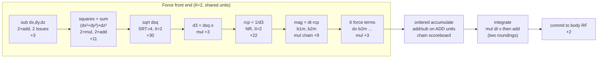
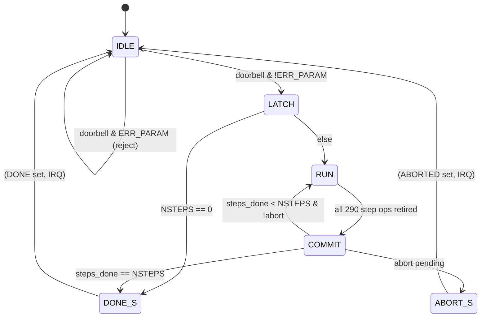

# grape_pipeline — uArch (Micro-architecture Spec)

Status: **approved** 2026-09-04 (uArch checkpoint). Stage 3 of `hw/FLOW.md`.
Inputs: `docs/prd.md`, `docs/mas.md` (approved), ADR-0002 (FP64 + operation order), ADR-0005,
ADR-0007 (own FP64 units, 3 add / 3 mul / sqrt / rcp, no FMA). Research:
`research/hw-algorithms-nbody.md` §3, `research/fp64-unit-sourcing.md`. Interview: `prompt.txt`
2026-09-04 (Q1–Q6 + FP64 spike). Reference model: `golden/emulation.py` (bit-exact target).

## 1. Block list (one RTL module per row, files under `rtl/`)

| Block | File | Function |
|---|---|---|
| top | `grape_top.sv` | wires everything; parameters N_BODIES=5, N_PAIRS_MAX=10 |
| AXI handshake | `../common/rtl/axi_lite_if.sv` | AXI4-Lite ⇄ simple register bus + `wr_resp_hold` (MAS §4.1; shared cell, built at hw-rtl) |
| register file | `grape_regs.sv` | MAS §4 map: decode, pending/latched config, STATUS W1C, IRQ, counters, committed-state read mux |
| body register file | `grape_body_rf.sv` | working + committed copies, 2 × 5 × 7 × 64 b flops; 2 read ports (pair i, j), 1 write port (accumulate/integrate/commit) |
| step FSM | `grape_step_fsm.sv` | Q5 states; pair sequencer; ABORT/ERR handling; counters |
| force pipeline | `grape_force_pipe.sv` | issues each pair's op graph to the shared units; II = 2 (static reservation from `docs/schedule_model.py`) |
| accumulate sequencer | `grape_accum.sv` | ordered velocity add/sub of pre-rounded force terms on the ADD units; 5 × 3 chain scoreboard; drives the integrate mul+add micro-ops |
| FP64 add/sub | `fp64_add.sv` (× 3) | 3-stage, IEEE binary64 RNE, full subnormals, canonical qNaN out |
| FP64 mul | `fp64_mul.sv` (× 3) | 3-stage, same properties |
| FP64 sqrt | `fp64_sqrt_srt.sv` | SRT-radix-4, 28 iterations + pre/post = 30 ± 2 cycles, **II = 2**, correctly rounded RNE |
| FP64 reciprocal | `fp64_rcp_nr.sv` | 2^10 × 20 b ROM seed + 3 NR iterations + Borges-compensated final step, all in **internal fixed point Q1.57** (not Python-visible, no intermediate IEEE rounding): per iteration 2 dependent 2-stage muls + 1 sub ≈ 5 cycles, 3 iterations 15, seed 1, residual compensation 4, final round 2 ⇒ **22 ± 2 cycles**, II = 2 (10 ops/step, interleaved 2-deep). Output **correctly rounded** (the compensated step guarantees it — Borges arXiv 2112.14321; PRD-F2 needs bit-equality with the model's IEEE division); DV cross-checks every result against HardFloat's divSqrtRecFN and directed rounding-boundary vectors |

Unit inventory (ADR-0007, from the schedule sweep): **3 × add, 3 × mul, 1 × sqrt, 1 × rcp — no
FMA unit**: every Python-visible mul and add/sub is a separate rounded binary64 op (fusing the
accumulate would break PRD-F2: `emulation.py` rounds `dx·b2m` and then the subtraction). FMA-style
residual arithmetic exists only inside `fp64_rcp_nr`'s fixed-point internals. All units flush nothing:
full IEEE subnormals (Q6); every unit raises {invalid, divzero, overflow, underflow} into the
sticky STATUS bits (PRD-F13) and emits canonical qNaN 0x7FF8000000000000 (PRD-F2 NaN rule).

## 2. Pipeline (per step; pair i issues at cycle 2i, i = 0..9)

Register boundaries at every `+n` arrow (the `n` includes the unit's internal pipeline
registers). The `+n` figures are the *dependency latencies*; actual issue cycles come from the
static schedule (§7): with 3 mul units the tail (mag chains, b1m/b2m, 60 force-term muls)
is issue-bandwidth-limited, not latency-limited. The accumulate consumes force terms strictly in
pair order.

## 3. FSMs

### 3.1 Step FSM (`grape_step_fsm.sv`)

**No op issue is gated on a phase transition** (review S1: phase-gating INTEG behind a full
scoreboard drain costs 4 cycles and busts the worst corner, 131 > 128). One RUN phase covers the
whole step: op issue is governed solely by the static reservation table generated from
`schedule_model.py`, which spans the force/accumulate/integrate regions — e.g. body b's dt·v mul
issues as soon as (b, c)'s last velocity write retires, while other bodies' accumulates are still
in flight. RUN→COMMIT when all 290 ops of the step have retired (a countdown, not per-phase
tracking); completion travels with valid bits. ABORT is sampled only in COMMIT
(PRD-F11: worst path = ABORT written 1 cycle after COMMIT sampled + worst step 127 + COMMIT 2 +
ABORT_S 1 ≈ 131 ≤ K1 + 8 = 136 ✓, arithmetic per review R12). Steps are strictly serial
(loop-carried dependence on positions) — that is what makes K1 latency-bound.

### 3.2 Register/control FSM (`grape_regs.sv`)

Doorbell acceptance (BRESP hold ≤ 4 cycles: ERR_PARAM = any pair field ≥ N_BODIES or NPAIRS >
N_PAIRS_MAX, combinational over the 10 latched pair words), W1C, IRQ registration (1 cycle),
config latch at accept, committed-copy write-back at DONE/ABORTED (MAS pending/latched/committed).

### 3.3 Accumulate sequencer (`grape_accum.sv`)

The force terms `dx_c·b2m` / `dx_c·b1m` are computed (and rounded) by the mul units in S7; the
accumulate then issues plain add/sub ops `v_i.c ← v_i.c − f_i.c`, `v_j.c ← v_j.c + f_j.c` on the
ADD units, in the emulation model's order (v_i's three components, then v_j's). A 5 × 3
scoreboard holds a busy bit per (body, component), set at issue, cleared at retire (add latency
3); a dependent op may issue in the clear cycle (bypass, review R13). Order between updates of
the same (body, component) is preserved by in-order issue per chain; everything else overlaps.
INTEG is mul-then-add (two roundings, exactly Python's `r[c] += dt*v[c]`): 15 muls on the MUL
units then 15 dependent adds on the ADD units, dependency-scheduled like every other op.

## 4. Number formats

| Signal group | Format |
|---|---|
| body state (x, v, m), DT, all architectural values | IEEE-754 binary64 (1s, 11e, 52m), RNE, full subnormals |
| sqrt internal root/remainder | fixed-point, 2.56 two's complement (Q2.56) partial remainder, 55-bit root accumulator |
| rcp NR iterates | unsigned Q1.57 mantissa approximations; seed Q1.19 from ROM |
| force terms dx·b1m etc, mag, b1m, b2m, dsq, d3 | binary64 (architectural intermediate — each is a Python-visible rounding point) |
| pair list entries | 2 × 8-bit unsigned indices |
| counters | unsigned 64/32-bit |

Every Python-visible intermediate is a rounded binary64 value in its own pipeline register — no
extra internal precision is carried across an operator boundary (bit-exactness, PRD-F2).

## 5. Memories

| Memory | Depth × width | Ports | Implementation |
|---|---|---|---|
| body RF (working + committed) | 2 × 35 × 64 b | 2R + 1W / bank | flops (~4.5 kflop) |
| pair list (latched) | 10 × 16 b | 1R (sequencer) | flops |
| rcp seed ROM | 1024 × 20 b | 1R sync | Yosys `$mem` → std-cell ROM (no OpenRAM macro; ~20 kb but ROM-compressible; PPA measures it) |
| microcode | none — control is FSM-generated | — | — |

## 6. Timing budget (target 20 ns @ 50 MHz; 10 ns @ 100 MHz design point)

| Stage | Critical path | Logic-depth estimate | ns @ sky130 tt (gate ≈ 0.15–0.25 ns) |
|---|---|---|---|
| fp64_add stage | align shifter (57-b barrel) or LZC + norm shifter | ~28 gates | 5–7 |
| fp64_mul stage | 53 × 53 partial-product tree slice (3-way split) | ~30 gates | 6–8 |
| sqrt iteration | radix-4 digit select (7-b compare) + CSA row | ~18 gates | 3–5 |
| rcp NR internal mul stage | 57-b fixed multiplier half | ~30 gates | 6–8 |
| regs/decode/scoreboard | 12-b decode, 15-b busy check | ~12 gates | 2–3 |

Every stage ≤ 8 ns < 20 ns budget ⇒ 50 MHz comfortable; 100 MHz needs the mul tree split into
3 stages exactly as planned (worst stage ~8 ns, marginal — the PPA stage measures and, if needed,
re-pipelines the mul to 4 stages — re-simulated with `schedule_model.py MUL_L=4` before acceptance).

## 7. Latency and throughput derivation (redo-able)

The step schedule is **simulated, not estimated**: `docs/schedule_model.py` builds the full
290-op graph of one step (26 ops × 10 pairs + 30 integrate ops — every op one Python-visible
binary64 rounding; per-(body, component) velocity chains in strict pair order) and list-schedules
it greedily in issue order onto the inventory. Per-step op totals: 125 ADD, 145 MUL, 10 SQRT,
10 RCP.

| Inventory | step cycles (nominal: sqrt 30 / rcp 22) | worst corner (32 / 24) |
|---|---|---|
| 2 add, 2 mul | 133 | — |
| 2 add, 3 mul | 125 | 129 ✗ |
| **3 add, 3 mul (chosen)** | **123** | **127 ✓** |
| 3 add, 4 mul | 117 | — |

Waypoints (3 add / 3 mul, nominal): last sqrt result 60, last rcp 85, last force-term mul 107
(issue-bandwidth-limited: 90 tail mul-ops on 3 units), last velocity write 111, integrate done
117, + COMMIT 2 + FSM 4 = **123 cycles/step ≤ K1 128** (worst corner 127). Benchmark:
20,000 × 123 = 2.46 M cycles → 49.2 ms @ 50 MHz (K4a input). The PRD stretch (≤ 64) is
unreachable at II = 2 and not pursued. The RTL's static reservation table is generated from this
model and checked by an SVA assertion (§8); a divergence between RTL issue and the model is a
DV failure, not a re-derivation.

## 8. Hazards and stalls

| Hazard | Mechanism |
|---|---|
| same body-component RAW in accumulate | chain scoreboard (3.3), clear-cycle bypass; stalls are already inside the simulated 123 (the model enforces the chains) |
| sqrt/rcp II = 2 vs issue II = 2 | matched — no structural stall |
| unit contention (145 mul-ops, 125 add-ops per step) | static reservation table generated by `docs/schedule_model.py` (greedy in-order list schedule, §7); no dynamic arbitration; an issue-slot conflict at runtime is caught by an SVA assertion and is a design bug |
| ABORT mid-step | sampled at COMMIT only |
| AXI write during BUSY | ignored at the regs block (ERR_BUSY), never reaches the datapath |
| NaN/Inf propagation | units propagate per IEEE; flags OR-ed into STATUS; no pipeline flush (PRD-F13: decode continues) |

## 9. Reset and CDC

Single clock domain; `rst_n` synchronous. No CDC anywhere (MAS §3). All architectural registers
reset to 0; pipeline registers are not reset (data-path only, qualified by valid bits which are
reset). **FP exception flags are captured valid-qualified per operation** — an idle or flushed
unit never sets a sticky bit (review R11) — and the Icarus X-check (DV sign-off gate) relies on
the same valid-qualification.

## 10. Traceability

| PRD / MAS | uArch element |
|---|---|
| PRD-F1/F2/F3 (order, bit-exactness) | §2 pipeline register boundaries at Python rounding points, §3.3 in-order issue, §4 no extra precision |
| PRD-F2 NaN rule | §1 canonical qNaN in every unit |
| PRD-F8 (NSTEPS=0) | §3.1 LATCH → DONE_S |
| PRD-F11 (ABORT ≤ K1+8) | §3.1 ABORT at COMMIT: worst 131 ≤ 136, arithmetic shown |
| PRD-F13 (IEEE flags), Q6 subnormals | §1 full-subnormal units, sticky flags; STATUS bit 16 stays 0 |
| PRD-F14 counters | §3.2 |
| PRD K1 ≤ 128 | §7 simulation: 123 (127 worst corner), `docs/schedule_model.py` |
| PRD K2 ≥ 50 MHz | §6 budget |
| MAS §4 pending/latched/committed | §3.2 |
| ADR-0007 | §1 inventory, §2 structure |

## 11. Review findings

See `docs/review_uarch.md` (written by `hw-review`).
