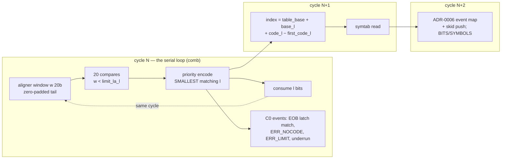
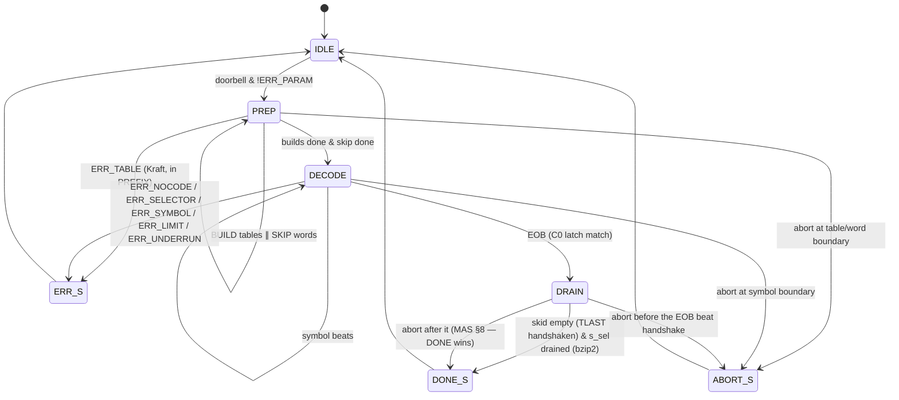

# huffman_engine — uArch (Micro-architecture Spec)

Inputs: approved `docs/prd.md`, `docs/mas.md`; ADR-0003 (comparator cascade), ADR-0006
(symbol-beat + withdrawal), ADR-0008 (design points: 1-cycle decode loop, folded counts, six
table register sets, shared symtab, extra-bits sub-FSM, output skid).
KPIs: K1 ≤ 1.1 cycles/symbol sustained, K2 ≤ 2×ALPHABET+MAXLEN per table, K3 ≥ 50 MHz.
Review pass 1 (U1..U9) is folded in; §11 records the findings.

## 1. Block list (one RTL module per row, files under `rtl/`)

| Module | File | Function |
|---|---|---|
| `huffman_engine` | `huffman_engine.sv` | top: wiring, stall fan-out, SVAs |
| `axi_lite_if` | `../common/rtl/axi_lite_if.sv` | shared AXI4-Lite → register bus (grape-proven) |
| `huff_regs` | `huff_regs.sv` | MAS §4 map; lengths window with folded per-(table,length) counts (§3.2); sticky/W1C/IRQ, counters, doorbell/ERR_PARAM |
| `huff_ctrl` | `huff_ctrl.sv` | invocation FSM: IDLE→(BUILD ∥ SKIP)→DECODE→DRAIN→DONE/ERR/ABORT |
| `huff_builder` | `huff_builder.sv` | per-table PREFIX (Kraft check → ERR_TABLE) + FILL; per-set EOB (len, code) latch |
| `huff_tables` | `huff_tables.sv` | 6 × (limit_la[20×21b], first_code[20×20b], base[20×11b], eob_len/eob_code) register sets + shared symtab (6×288×10b flops, 1W/1R); active-set mux |
| `huff_aligner` | `huff_aligner.sv` | 64b buffer + 2-beat prefetch FIFO (§5, OVERFETCH ≤ 4 beats total — U9), barrel shifter peek MAXLEN / consume ≤20, 32b concurrent refill, whole-word SKIP discard, TLAST/tkeep last-valid-bit tracking (ERR_UNDERRUN), zero-padded tail, DEFLATE window bit-reverse |
| `huff_decoder` | `huff_decoder.sv` | the 1-cycle loop: 20 parallel limit compares + priority encode + consume; EOB/ERR_NOCODE/ERR_LIMIT detected in C0 |
| `huff_selector` | `huff_selector.sv` | 50-symbol counter, 1-deep selector skid, 0-cycle set switch, ERR_SELECTOR |
| `huff_deflate` | `huff_deflate.sv` | DEFLATE resolve stage + extra-bit consumes (mode runs the loop at II=2 — §2) |
| `huff_out` | `huff_out.sv` | 2-deep output skid, ADR-0006 withdrawal, EOB/TLAST, SYMBOLS/BITS counter feed |

## 2. Pipeline

**bzip2 mode (K1-binding): 1 symbol/cycle.**

Register boundaries after C0 and C1; nothing in C1/C2 feeds C0. **Every decode-stopping event
is C0-visible** (review U2): EOB compares the decoded (l, code) against the active set's
`(eob_len, eob_code)` latch (written at build — EOB's code is known per table);
ERR_NOCODE = no compare matches; ERR_LIMIT: C0 stops issuing when the **issued** count
reaches SYMBOL_LIMIT — since every issued beat is eventually emitted (absent
error-withdrawal), exactly LIMIT beats emerge after drain, matching MAS 0x110's emitted
semantics (review N3); **EOB wins the same-cycle tie** (EOB at the LIMIT-th symbol → DONE,
not ERR_LIMIT). The sticky ERR_LIMIT is raised when the LIMIT'th beat **handshakes** (a
drain-style stop): no in-flight beat is withdrawn — ERR_LIMIT is exempt from the §8 flush,
so SYMBOLS lands exactly at LIMIT. Underrun = consume past the last valid bit (§8). No phantom decodes: C0
halts on the event cycle, BITS counts exactly the consumed code bits (PRD-F4/F13).

**DEFLATE mode: II=2** (decode cycle + resolve cycle; ADR-0008 #6 refined by U2): the resolve
cycle reads symtab, classifies literal / length 257–285 / invalid 286–287 (symtab valid bit),
and lets `huff_deflate` consume extra bits before the next decode cycle. Costs ×2 on a
non-KPI mode; removes all C1-event rewind machinery.

## 3. FSMs

### 3.1 Control FSM (`huff_ctrl.sv`)

**PREP = BUILD ∥ SKIP** (review U8): the builder walks tables while the aligner discards
`START_BIT/32` whole words (1/cycle) and then the sub-word remainder; DECODE starts when both
finish — first symbol ≤ max(N_TABLES×(ALPHABET+MAXLEN), ⌈START_BIT/32⌉) + 2 (§7).
DRAIN also consumes remaining `s_sel` beats to TLAST in bzip2 mode (the DMA must complete).
ABORT sampled at symbol/word/table boundaries (PRD-F11 bounds hold: ≤ 8 / ≤ 16 cycles).
Error set is exactly MAS §4's: ERR_PARAM (doorbell), ERR_TABLE, ERR_NOCODE, ERR_SELECTOR,
ERR_SYMBOL (DEFLATE resolve only — bzip2 symbols are valid by construction), ERR_LIMIT,
ERR_UNDERRUN. Input starvation is a stall, never an error (PRD-F6 — review U6).

### 3.2 Build FSM (`huff_builder.sv`), per table

PREFIX (MAXLEN cycles): `first_code[l] = (first_code[l−1] + count[t][l−1]) << 1`; running
`base[l]`; `limit_la[l] = (first_code[l] + count[t][l]) << (MAXLEN − l)` registered per set;
**Kraft check**: overflow of `first_code[l] + count[t][l]` past `2^l` → ERR_TABLE (review U7 —
the check the removed counts pass used to provide). `count[t][l] == 0` yields
`limit_la[l] == la(first_code[l])` — an empty range that can never match (U1 form). For
DEFLATE (MAXLEN_eff = 15), lengths 16..20 have counts 0 → non-matching by the same rule.
FILL (ALPHABET cycles): symbol s with `len[t][s] = l ≠ 0` → `symtab[table_base[t] + base[l] +
next[l]++] = {valid, s}`; the EOB symbol's (l, code) is latched into the set's
`(eob_len, eob_code)` when s == ALPHABET−1 (bzip2) / 256 (DEFLATE, literal/length table
only). **All six eob latches are cleared (eob_len := 0) at PREP entry** (review N2): a set
that never latches — the DEFLATE distance set, or a stale set from the previous invocation —
can never produce a false EOB (len 0 never matches a decode).

**Folded counts** (ADR-0008 #4, contract per review U3/U4): counts are **per (table, length)**
— `count[6][20]` 9b bins. A write to lengths-window word w attributes by ADDRESS
(table = (w − LEN_BASE) / 48 — MAS amendment 2026-09-08: per-table 48-word strides), never by
pending ALPHABET. The write is an RMW against the stored word: decrement the 6 old fields'
bins, increment the 6 new (12 × 9b adders, one cycle, §6); a field > MAXLEN increments the
per-table **invalid bin** instead — nonzero at the doorbell → **ERR_TABLE** (MAS bit 10 —
review N14); in DEFLATE mode a nonzero count in bins 16..20 of a used table likewise →
ERR_TABLE at the doorbell (N9 residual). Both are O(1) checks on the folded bins. Counts therefore always equal the
full window content; entries ≥ ALPHABET must be 0 (reset value; `HuffmanDriver` zeroes on
shrink — MAS amendment 2026-09-08 driver contract) so PREFIX over any ALPHABET is exact. Lengths-window
writes with `wstrb ≠ 4'hF` are ignored whole (no partial-field attribution).

### 3.3 Selector FSM (`huff_selector.sv`)

`sym_cnt` 0..49; pop the 1-deep selector skid before symbol 0 and every 50 symbols →
`cur_set` (0-cycle switch — the compare set for symbol 50k is the NEW table's, PRD-F1: the pop
happens in the stall-free cycle boundary before that symbol's C0). Selector ≥ N_TABLES →
ERR_SELECTOR at the symbol where it would apply. Skid empty at pop = stall (PRD-F6).

## 4. Number formats

Unsigned throughout (`UQn.0`). Window `w` `UQ20.0` (MSB-first; DEFLATE: the bit-reversed
15-bit peek occupies `w[19:5]` — **top-aligned, low 5 bits zero** (review N1) — so every
compare stays MAXLEN-aligned against `limit_la` and lengths 16..20 stay non-matching via zero
counts). **Compare form (review U1)**: per length l, the set stores
`limit_la[l]` `UQ21.0` = `(first_code[l] + count[l]) << (MAXLEN − l)` — 21 bits because the
sum reaches `2^l`. Match(l) = `{1'b0, w} < limit_la[l]` (zero-extended on the LEFT of the
comparison operand order: `w` occupies bits 19:0, limit_la bits 20:0). The decoded length is
the **smallest** matching l (priority encode); canonical monotonicity of `limit_la` makes the
one-sided compare exact, and `w ≥ la(first_code[l])` holds automatically at the chosen l
(`la(first_code[l]) = limit_la[l−1]`, the recurrence). ERR_NOCODE = no l matches.
Index datapath: `code_l` `UQ20.0` (w >> (MAXLEN − l)), `first_code[l]` `UQ20.0`, `base[l]`
`UQ11.0`, `table_base[t]` `UQ11.0`; index = table_base + base + (code_l − first_code) fits
`UQ11.0` (≤ 6×288 = 1,728 — the per-table sums are bounded by ALPHABET, no overflow).
symtab entry `UQ10.0` = {valid, sym[8:0]}. Lengths `UQ5.0`, counts `UQ9.0`, selector `UQ3.0`,
occupancy `UQ7.0`, START_BIT `UQ32.0`; counters per MAS.

## 5. Memories

| Memory | Size | Ports | Impl |
|---|---|---|---|
| symtab (shared, ADR-0008 #3) | 1,728 × 10 b = 17.3 kbit | 1W (build) / 1R (decode; DBG_DATA reads valid outside FILL cycles, 0 during — MAS amendment) | flops |
| limit_la sets | 6 × 20 × 21 b = 2.5 kbit | builder W / cur_set mux R | flops |
| first_code sets | 6 × 20 × 20 b = 2.4 kbit | same | flops |
| base sets + table_base + eob latch | 6 × (20×11 + 11 + 25) b ≈ 1.5 kbit | same | flops |
| count bins | 6 × 20 × 9 b = 1.1 kbit | RMW on cfg write / builder R | flops |
| lengths window | 6 × 288 × 5 b = 8.6 kbit (review U5) | AXI RMW / builder R | flops |
| aligner | 64 b buffer + 2×32 b FIFO (U9: total unconsumed ≤ 128 b = 4 beats, the MAS OVERFETCH cap) | stream/barrel | flops |
| output skid | 2 × 33 b | — | flops |

≈ 34 kbit of flops — still far under grape's fabric; K5 1.0 mm² soft ceiling plausible.

## 6. Timing budget (target 20 ns @ 50 MHz)

| Path | Logic | Est. depth |
|---|---|---|
| C0 loop: barrel shift (6 mux lvls) → 20× 21b compare (parallel) → priority 20→5 → consume add | ≈ 13 ns | fits; ADR-0008 #1 retreat (II=2) documented |
| C0 events: eob (len,code) equality + limit/underrun compares | parallel with priority | ≤ C0 |
| symtab index add + 1,728:1 read mux | ≈ 8 ns | C1 |
| lengths-window RMW: 12 × 9b inc/dec | ≈ 6 ns | regs write path |
| refill/FIFO, build FILL, AXI paths | short | < 10 ns |

## 7. Latency and throughput derivation (simulated, not stage-summed)

`docs/decode_model.py` on the REAL benchmark trace (148,271 symbols, per-symbol lengths,
START_BIT 8,844), modeling the C0 gate (`occ ≥ MAXLEN` with zero-padded tail), the 2-beat
FIFO, beat-arrival cadence, SKIP ∥ BUILD, folded builds:

- **benchmark: K1 = 1.0068** (149,276 cycles; build 1,002; skip 276 fully hidden; 1 refill
  stall; 0 out stalls) ≤ **1.1** ✓
- all-20-bit codes: steady-state 1 sym/cycle (20 ≤ 32 refill)
- DMA at 6.4 b/cycle (beat every 5): 1.0093; at 4 b/cycle sustained (beat every 8, above
  the 3.585 b/sym mean but starving bursts, skip delivery throttled too — N8): 1.0317 — ≤ 1.1
- output backpressure 1-in-4: 1.2568, lossless (PRD-F6)
- **K2 = 167 ≤ 314** (alphabet 147, 1.88×); 308 ≤ 596 at ALPHABET_MAX ✓
- first symbol ≤ max(1,002, 277) + 2 = 1,004 cycles
- K4a: 149,276 cycles @ 50 MHz = 2.99 ms ≤ 3.06 ms ✓ (DV measures the real number at
  sign-off; grape practice)

## 8. Hazards and stalls

| Hazard | Mechanism |
|---|---|
| length→window recurrence | closed in C0 (ADR-0008 #1) |
| symbol-value events (EOB/limits) | C0-visible: per-set eob latch, SYMBOLS compare, no-match, last-valid-bit (U2); DEFLATE value classes at the II=2 resolve cycle |
| aligner underrun vs stream end | `last_valid_bit` from TLAST/tkeep; consume past it → ERR_UNDERRUN; before TLAST, occupancy < MAXLEN stalls (zero-pad only after TLAST) |
| DMA starvation | stall, never loss/error; §7 sweeps |
| overfetch at EOB | buffer+FIFO capacity = 4 beats total (U9): accepted-but-unconsumed provably ≤ the MAS cap (amendment: SKIP-discarded words are consumed, outside the cap); `tready` drops when FIFO full |
| selector switch / starvation | 1-deep skid; 0-cycle switch; empty = stall |
| output skid full | single `stall` freezes C0..C2 |
| build vs decode | serial by FSM; SKIP ∥ BUILD are independent units (aligner vs builder) |
| withdrawal (ADR-0006) | skid flush on ERR/ABORT/doorbell (ERR_LIMIT exempt — it drains, §2); SYMBOLS counts handshaken beats only (the withdrawn beat is not "emitted", MAS counter semantics) |

## 9. Reset and CDC

Single clock, synchronous `rst_n`, no CDC; architectural regs → 0; stream handshakes drop in
one cycle; valid-qualified datapath (grape §9 pattern).

## 10. Traceability

| PRD / MAS | uArch element |
|---|---|
| PRD-F1 (block, selector cadence, first symbol) | §3.1 PREP∥, §3.3, §7 first-symbol row |
| PRD-F2 (canonical decode) | §2 C0 + §4 limit_la form (U1) |
| PRD-F3 (HW build, 0 = unused) | §3.2 + driver-zeroing contract |
| PRD-F4 (bit-exact BITS, START_BIT) | §2 C0 events (U2), §3.1 SKIP |
| PRD-F5 / ADR-0006 | §1 huff_out, §8 withdrawal |
| PRD-F6 (stall-only backpressure) | §8 starvation/skid rows (U6) |
| PRD-F7/F8 (config, capacities) | §3.2 contract, §5 |
| PRD-F9 (ERR_PARAM) | huff_regs doorbell check |
| PRD-F10 (run-time errors) | §3.1 error set incl. ERR_TABLE/ERR_UNDERRUN/ERR_SYMBOL/ERR_LIMIT (U7) |
| PRD-F11 (control, abort bounds) | §3.1 |
| PRD-F12 (counters) | §2 C2, §8 withdrawal row |
| PRD-F13 (multi-block) | BITS exactness (U2) + DRAIN |
| K1 / K2 / K3 | §7 / §7 / §6 |

## 11. Review findings

See `docs/review_uarch.md` — pass 1: 9 must (U1 compare direction, U2 phantom decodes,
U3 shared counts, U4 attribution, U5 window size, U6 phantom flags, U7 missing error
mechanisms, U8 SKIP cost, U9 overfetch) — all folded into this revision; pass 2 verifies.
