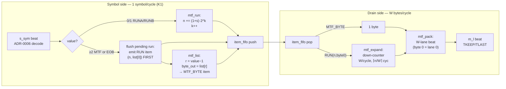
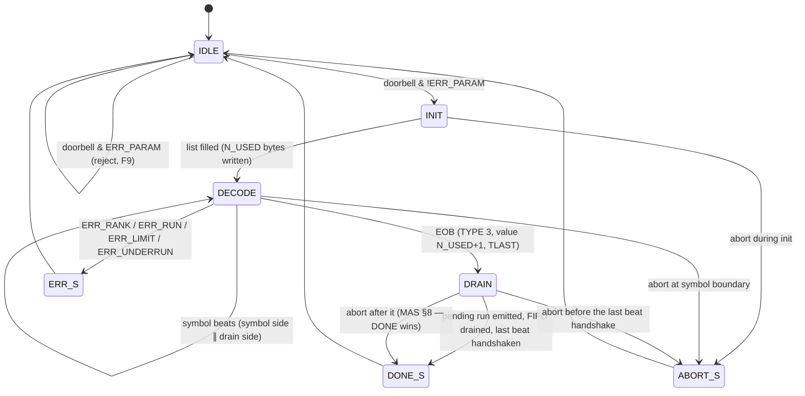
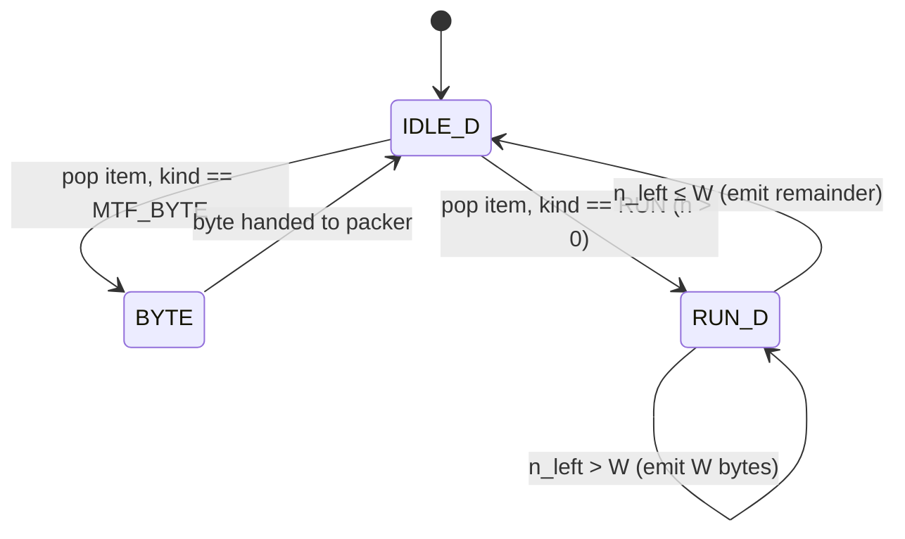

# mtf_cam — uArch (Micro-architecture Spec)

Status: **draft** 2026-09-12 (uArch stage, awaiting review). Stage 3 of `hw/FLOW.md`.
Inputs: approved `docs/prd.md` (KPIs K1–K8, PRD-F1..F16), approved `docs/mas.md` (I/O §2, register
map §4, data path §5, error/status §8), ADR-0001 (bus family), ADR-0004 (chained module, expander
width parameter W), ADR-0005 (register conventions), ADR-0006 (symbol beat). Reference models:
`golden/mtf_ref.py` (bit-exact target == libbzip2) and the predictor `golden/list_model.py`
(`expand` functional model, `cycles` cycle model). The §6/§7 numbers are reproduced by
`docs/schedule_model.py`, which runs the frozen golden `cycles` on the real benchmark trace.

## 1. Block list (one RTL module per row, files under `rtl/`)

| Module | File | Function |
|---|---|---|
| `mtf_cam` | `mtf_cam.sv` | top: wiring, the two-sided split (symbol side ∥ drain side), item-FIFO instance, stall fan-out, SVAs |
| `axi_lite_if` | `../common/rtl/axi_lite_if.sv` | shared AXI4-Lite → register bus (grape/huffman-proven) |
| `mtf_regs` | `mtf_regs.sv` | MAS §4 map: USED[0..7], SYMBOL_LIMIT, BYTES_LIMIT, CTRL/STATUS (W1C)/IRQ, CAPS, DBG_SEL/DBG_DATA, counters (CYCLES/SYMBOLS_IN/BYTES_OUT/INIT_CYCLES/MAX_RUN); doorbell + ERR_PARAM (F9), ERR_BUSY, latching |
| `mtf_ctrl` | `mtf_ctrl.sv` | invocation FSM IDLE→INIT→DECODE→DRAIN→DONE plus ERR/ABORT (§3.1); symbol-side sequencer (list lookup + run accumulate → item FIFO); per-symbol error detect (ERR_RANK/ERR_RUN/ERR_LIMIT/ERR_UNDERRUN) |
| `mtf_list` | `mtf_list.sv` | N_LIST=256-entry **shift-register CAM**: init fill from the used map, 256:1 rank read mux, registered move-to-front shift; DBG_DATA read port (§3.2) |
| `mtf_run` | `mtf_run.sv` | RUNA/RUNB accumulator `n += (1+s_k)·2^k`, k = run position; captures the rank-0 byte at the terminating symbol; ERR_RUN on n > 2^20; MAX_RUN feed |
| `item_fifo` | `item_fifo.sv` | depth-D (D=8) FIFO of items `{kind, byte, n}` decoupling the symbol side from the drain side (PRD-F7); `s_sym.tready` gate when full |
| `mtf_expand` | `mtf_expand.sv` | drain side: pops an item; MTF_BYTE → 1 byte, RUN(n,byte0) → n copies streamed W bytes/cycle (down-counter, ⌈n/W⌉ cycles) |
| `mtf_pack` | `mtf_pack.sv` | beat packer: accumulates the byte stream into W-lane beats (byte 0 = lane 0), full beat = TKEEP all ones, last/flush beat = TKEEP contiguous-from-lane-0 (+TLAST at DONE, no TLAST on ERR/ABORT); `m_l.tvalid` registered (PRD-F6) |

**Two-sided design (the central decision).** `mtf_cam` splits into a SYMBOL SIDE (`mtf_list` +
`mtf_run`, driven by `mtf_ctrl`) that consumes `s_sym` at 1 symbol/cycle and produces *items*, and
a DRAIN SIDE (`mtf_expand` + `mtf_pack`) that consumes items and produces `m_l` beats. The `item_fifo`
(depth D) is the seam. This decouples the 1-cycle MTF byte from a multi-cycle run expansion, so the
symbol side sustains 1 symbol/cycle (K1) even across an 8,157-byte run — which is exactly what buys
K3 = 1.063 at D = 8 (vs 1.370 fully serialised at D = 0; §7). **Alternative REJECTED**: a single
serial pipeline (expand each run inline before accepting the next symbol) — that is the D = 0 point,
1.370 cycles/symbol, over the K3 ≤ 1.10 ceiling by 25 %.

An **item** is `{kind ∈ {MTF_BYTE, RUN}, byte[7:0], n[20:0]}` — a byte to emit, or a run of `n`
copies of `byte`.

## 2. Pipeline / dataflow

Two independent flows joined by the item FIFO; both run concurrently in DECODE.



Register boundaries: `s_sym` beat → symbol-side state (list shift, run accumulator) is one cycle;
item FIFO push/pop is a register boundary; `mtf_pack` → `m_l` is registered (`tvalid` never combinational
on `tready`, PRD-F6). The **run-ordering rule** (PRD-F3, §5 of MAS) is enforced on the symbol side:
at the first non-run symbol (an MTF value ≥ 2, or EOB), if a run is pending the RUN item carrying the
**current** `list[0]` byte is pushed *before* the terminating symbol's own MTF lookup and MTF_BYTE
item — the run bytes are copies of the rank-0 byte as it stood *before* the MTF symbol moves a new
byte to the front. Item production and drain overlap; the symbol side stalls only when the FIFO is
full (§8).

## 3. FSMs

### 3.1 Invocation FSM (`mtf_ctrl.sv`)



- **IDLE**: `s_sym.tready` = 0. A doorbell latches config and, unless rejected by ERR_PARAM
  (N_USED = 0 or > N_LIST, SYMBOL_LIMIT 0/>2^27, BYTES_LIMIT 0/>2^30 — F9), moves to INIT. CYCLES
  restarts at the accepted doorbell.
- **INIT** (PRD-F4): build `mtf_list` from the 256-bit used map as the ascending sequence of used
  byte values, one byte/cycle, ≤ 256 cycles; INIT_CYCLES counts them. `s_sym.tready` stays 0.
- **DECODE**: symbol side runs (1 sym/cycle) and drain side runs concurrently. Per-symbol errors
  (ERR_RANK: value > N_USED+1, TYPE 1/2, EOB type/value mismatch; ERR_RUN: run > 2^20; ERR_LIMIT:
  the SYMBOL_LIMIT-th beat is not EOB, or BYTES_OUT + bytes-in-flight + this item would exceed
  BYTES_LIMIT — checked at item production, item not enqueued; ERR_UNDERRUN: TLAST on a non-EOB
  beat) → ERR_S. EOB → DRAIN.
- **DRAIN**: finish the pending run (if the last symbol before EOB left one), drain the item FIFO,
  and flush the packer's partial beat with TLAST. DONE the cycle after the last beat is handshaken
  (empty block: no beat, DONE the cycle after the EOB handshake — MAS Q1).
- **ERR_S**: freeze at the offending symbol. Item FIFO / expander / pending run **discarded**; the
  packer's partial beat (if any) is flushed with TKEEP contiguous, **no TLAST**; BUSY = 0, flag +
  IRQ; SYMBOLS_IN frozen at the offending beat; BYTES_OUT counts the flushed partial when handshaken;
  CYCLES stops at the flag (PRD-F10, MAS §8).
- **ABORT_S**: ≤ 8 cycles in any state (PRD-F11). Same flush as ERR (partial beat, no TLAST). ABORT
  wins over a same-cycle doorbell; ABORT after the last beat is handshaken → DONE only.

Cross-invocation: an accepted doorbell clears the FIFO, packer and run accumulator and rebuilds the
list at INIT; it withdraws any still-pending `m_l` beat (`tvalid` → 0, not counted) so every block
starts with empty streams (MAS §5). Reset (synchronous active-low) → IDLE, every register 0.

### 3.2 List CAM state (`mtf_list.sv`)

Not a control FSM — a datapath with two operations selected by `mtf_ctrl`:

- **INIT fill**: a used-map scanner walks byte values 0..255; on each present bit it writes the
  value into `list[fill_ptr]` and increments `fill_ptr` (= running popcount). After N_USED writes
  the list holds the ascending used bytes; `fill_ptr` = N_USED. ≤ 256 cycles (INIT_CYCLES).
- **Lookup + move-to-front** (one cycle, registered): for rank `r` (= symbol value − 1, 1..N_USED−1),
  `byte_out = list[r]` via the 256:1 read mux, and the next-state shift is
  `list_n[0] = byte_out; list_n[k] = list[k−1] for 1 ≤ k ≤ r; list_n[k] = list[k] for k > r`.
  Each entry k is a 3:1 mux selected by two parallel comparisons of the incoming rank: `k == 0`
  (take `byte_out`), `1 ≤ k ≤ r` (take `list[k−1]`), else hold. The `k ≤ r` term is a single 8-bit
  magnitude comparator per entry, all 256 in parallel.
- **DBG read**: `DBG_DATA` = `list[DBG_SEL]` (live; 0 for rank ≥ N_USED or before the first init).

**Alternative REJECTED (PRD open-question 4): RAM + move pointer / linked list.** A RAM-backed
list cannot do a move-to-front in one cycle: promoting rank r to the front requires either O(r)
sequential single-port RAM shifts or a full re-link of a linked list — both bust K1's 1 symbol/cycle
(mean rank 7.17, max 144). The shift-register CAM does the whole shift in parallel in one cycle,
which is the throughput/area trade-off documented in §5 and swept at PPA (K6).

### 3.3 Drain-side expander (`mtf_expand.sv`)



A down-counter `n_left` starts at the item's `n`; each cycle the expander presents `min(n_left, W)`
copies of `byte0` to the packer and subtracts. A run of n bytes takes ⌈n/W⌉ cycles (K2 = W
bytes/cycle sustained). Back-pressure (`m_l.tready` low) freezes the counter without loss (§8).

## 4. Number formats

Pure integer/byte — **no fixed-point arithmetic** anywhere (unlike grape's FP64 datapath).

| Signal group | Format |
|---|---|
| MTF rank `r` (symbol value − 1) | `UQ8.0` (0..255; used 1..N_USED−1, rank 0 never occurs — F2) |
| list entry / byte / `byte_out` / `byte0` | `UQ8.0` |
| run accumulator `n`, MAX_RUN | `UQ21.0` (RUN_W = 21, holds 2^20; ERR_RUN if an add exceeds) |
| run position `k` | `UQ5.0` (0..20; the 21st add is the overflow, F3) |
| `m_axis_l_tdata` | `8·W` bits (W lanes of `UQ8.0`; byte 0 in `[7:0]`, lowest lane first — MAS §2) |
| `m_axis_l_tkeep` | `W` bits (all ones except the last/flush beat, contiguous from lane 0) |
| used map | 256 bits (8 × 32-bit words); N_USED = popcount, `UQ9.0` (1..256) |
| CYCLES | `UQ64.0` (MAS 0x040/0x044; ≤ 2^27 + 2^30/W ≪ 2^64) |
| SYMBOLS_IN / BYTES_OUT | `UQ32.0` (MAS 0x048 / 0x04C) |
| INIT_CYCLES | `UQ9.0` (MAS 0x050; ≤ 256) |
| SYMBOL_LIMIT / BYTES_LIMIT | `UQ32.0` (1..2^27 / 1..2^30, MAS 0x100 / 0x104) |

The run accumulate is a shift-and-add: `s ∈ {0,1}` gives `(1+s) ∈ {1,2}`, so the increment is
`2^k` (RUNA) or `2^(k+1)` (RUNB) — a single one-hot addend into a 21-bit adder, `k` incrementing per
run symbol. This is bit-exact to `golden/list_model.py` (`run += (1<<k)*(1+s)`).

## 5. Memories

| Memory | Size | Ports | Implementation |
|---|---|---|---|
| MTF list (shift-register CAM) | 256 × 8 b = **2,048 flops** | 256:1 rank read mux + 1 DBG read; parallel registered shift-write of all 256 entries | **flops** (no RAM — needs the parallel shift, §3.2) |
| item FIFO | D × 30 b (kind 1 + byte 8 + n 21); D = 8 → 240 b | 1W (symbol side) / 1R (drain side) | flops |
| packer beat register | W × 8 b (W = 16 → 128 b max) | byte-lane fill / beat read | flops |
| run accumulator + k + rank-0 latch | 21 + 5 + 8 b | 1RW | flops |
| register file (MAS §4) | ~ 8×32 used + limits + counters + dbg | AXI RW / datapath | flops |

≈ 2.4 kbit of flops total — the **2,048-flop list dominates** and far under the huffman/grape fabric;
K6's 1.0 mm² soft ceiling is comfortable. **K6 area note (PRD open-question 4)**: the list is flops,
not a BRAM/OpenRAM macro, precisely because the move-to-front needs a parallel single-cycle shift of
every entry — a RAM would force the O(r) shift that busts K1. That is the deliberate area↔throughput
trade of this stage. The **W sweep (4/8/16) changes only `mtf_pack`/`mtf_expand` width** (the packer
beat register and the expander down-counter datapath), **not the 2,048-flop list** — so area moves
little across the sweep while K3 moves 1.175 → 1.063 → 1.023 (§7). No macros anywhere.

## 6. Timing budget (target 20 ns @ 50 MHz; sky130 tt gate ≈ 0.15–0.25 ns)

| Path | Logic | Est. depth | ns |
|---|---|---|---|
| INIT fill: used-map bit scan → `list[fill_ptr]` write, popcount increment | 8-bit scan + write mux | ~8 gates | ~2 |
| **list read: rank derive (r = value−1) → 256:1 read mux → `byte_out` (→ `list_n[0]`)** | 8-bit sub + 8-level 2:1 mux tree | **~18 gates** | **~6–8 (worst comb path)** |
| list shift-select: per-entry `k ≤ r` compare (8-bit) + 3:1 mux → `list_n[k]` | 8-bit compare + mux, ×256 parallel | ~10 gates | ~3 |
| run accumulate: one-hot `2^k`/`2^(k+1)` → 21-bit add + `> 2^20` compare | 21-bit CPA + compare | ~14 gates | ~4 |
| expand/pack: `min(n_left,W)` down-count, W-lane assemble, TKEEP/TLAST | 21-bit sub + lane mux | ~12 gates | ~3–4 |
| AXI-Lite: 12-bit address decode, register read/write mux | decode + mux | ~10 gates | ~2–3 |

**Worst path is the list read** (§3.2): the 256:1 read mux is a balanced 8-level (log₂256) 2:1 mux
tree — one level *deeper* than huffman's 1,728:1 symtab read (which the huffman uArch budgets at
~8 ns in a *pipeline* stage), but here it is 256 not 1,728 fan-in, so the tree is narrower per level.
The shift-select's `k ≤ r` is a single comparator per entry, all 256 in parallel and driven by `r`
which is available a gate after the beat decode — it does not add to the read-mux depth. Estimated
~6–8 ns leaves comfortable margin under the 20 ns budget ⇒ **K4 ≥ 50 MHz met with margin**; the 100
MHz stretch (10 ns) is plausible but read-mux-limited and is the number the PPA stage measures. Every
other row is well under 20 ns.

## 7. Latency and throughput derivation (simulated, not stage-summed)

Reproduced by `docs/schedule_model.py`, which runs the **frozen golden** `golden/list_model.cycles`
on the real benchmark symbol trace (`golden/mtf_ref.trace_benchmark`: 148,271 symbols = 89,837 MTF +
58,433 RUNA/RUNB + 1 EOB, 145 used bytes, alphabet 147, 34,664 run groups, MAX_RUN 8,157). The model
= init (N_USED cycles) + symbol side (1/cycle, producing items into a depth-D FIFO) + drain side
(1 cycle per MTF byte, ⌈n/W⌉ per run at W bytes/cycle); it is validated against the DUT in
`test_full_benchmark` (PRD-F15).

**Design point W = 8, D = 8: K3 = 1.063 cycles/symbol** (157,560 cycles ≤ the 163,098 ceiling) ≤ 1.10 ✓
— reproduced, not invented (`schedule_model.py` prints `CYCLES 157560 -> K3 = 1.063`). Lower bound
max(148,271, 144,533)/148,271 = 1.000.

**D-sweep at W = 8** (item-FIFO depth trades a few flops for K3; PRD open-question 3):

| D | cycles | K3 |
|---|---|---|
| 0 (fully serialised — no FIFO, rejected) | 203,112 | 1.370 |
| **8 (chosen)** | **157,560** | **1.063** |
| 32 | 155,033 | 1.046 |
| 128 | 153,518 | 1.035 |

D = 8 already sits at 1.063; the next 4× (D = 32) buys only 0.017 and 16× (D = 128) 0.028 — not
worth the flops, so D = 8 is the chosen point (CAPS reports it).

**W-table at D = 8** (expander/packer width; the PPA sweep, K6):

| W | cycles | K3 |
|---|---|---|
| 4 | 174,225 | 1.175 (> 1.10 — needs W ≥ 8) |
| **8 (default)** | **157,560** | **1.063** |
| 16 | 151,755 | 1.023 (K3 stretch) |

**K1**: the symbol side accepts 1 symbol/cycle for any rank 1..255 (the list read + parallel shift is
one registered cycle); the directed run-free stream of 4,096 symbols completes in INIT_CYCLES + 4,096
+ pipeline latency, with pipeline latency ≤ 8 cycles (item FIFO push → expand → pack → `m_l`) ✓.
**INIT** = N_USED = 145 cycles ≤ 256 (INIT_CYCLES). **K5**: 157,560 cycles @ 50 MHz = **3.15 ms**.

## 8. Hazards and stalls

| Hazard | Mechanism |
|---|---|
| long run blocking new symbols | the item FIFO (§1, D = 8) decouples them: a RUN item is one push; the symbol side keeps taking 1 sym/cycle while the drain side spends ⌈n/W⌉ cycles — the whole point of the two-sided design (§7 D = 0 vs 8) |
| FIFO full | `s_sym.tready` drops when `occupancy + this-symbol's-items > D` (a run-terminating MTF symbol produces up to 2 items — RUN then MTF_BYTE — so the check reserves 2 slots); no symbol lost or duplicated (PRD-F7) |
| run-ordering (rank-0 byte captured before the MTF move) | symbol side pushes the RUN item using `list[0]` *before* the terminating symbol's lookup/shift (§2, PRD-F3) |
| output back-pressure (`m_l.tready` low) | freezes `mtf_expand`'s down-counter and `mtf_pack`; lossless (PRD-F6); `m_l.tvalid` registered, never combinational on `tready` |
| BYTES_LIMIT overshoot | checked at item production on the symbol side: BYTES_OUT + bytes accepted-not-yet-handshaken (FIFO + expander + packer) + this item > BYTES_LIMIT → ERR_LIMIT, item not enqueued, so BYTES_OUT ≤ BYTES_LIMIT always (MAS §4) |
| per-symbol errors | detected on the symbol side ≤ 4 cycles after the offending handshake; freeze, discard FIFO/expander/pending run, flush partial beat no-TLAST, IRQ ≤ 2 cycles after the flag (PRD-F10) |
| init vs decode | serial by FSM (INIT → DECODE); `s_sym.tready` = 0 until fill done |
| AXI write during BUSY | ignored at `mtf_regs` (ERR_BUSY), never reaches the datapath; STATUS/DBG/counters stay live (MAS §4) |
| ABORT mid-run / mid-drain / stalled | sampled every cycle, ≤ 8 cycles; discard + partial-flush no-TLAST (PRD-F11) |
| doorbell / reset with a beat pending | withdraws the pending `m_l` beat (`tvalid` → 0, not counted); every block starts empty (MAS §5) |

## 9. Reset and CDC

Single clock domain; `rst_n` synchronous active-low, ≥ 1 cycle (MAS §3). **No CDC** anywhere. All
architectural registers (config, STATUS, counters, FSM state) reset to 0; the list contents are
undefined until the first INIT (DBG_DATA reads 0 before it). Stream handshakes (`tready`/`tvalid`)
drop in one cycle; the datapath is valid-qualified (grape/huffman §9 pattern) so an idle or flushed
stage sets no sticky bit. `irq` is registered (1 cycle).

## 10. Traceability

| PRD / MAS | uArch element |
|---|---|
| PRD-F1 (one block, EOB rules, DONE) | §3.1 INIT→DECODE→DRAIN→DONE, EOB decode §2 |
| PRD-F2 (MTF semantics) | §3.2 lookup + move-to-front, bit-exact to `golden/list_model.py` |
| PRD-F3 (run semantics, ordering) | §2 run-ordering rule, §3.1 DECODE, `mtf_run` §1, §4 shift-and-add |
| PRD-F4 (init from used map, ≤ 256 cyc) | §3.2 INIT fill, §7 INIT = 145 cycles |
| PRD-F5 / K8 (list invariants, formal) | §3.2 permutation/shift is the invariant proved on N_LIST = 16 (`make formal`) |
| PRD-F6 (byte-packed `m_l`, registered tvalid) | `mtf_pack` §1, §2 register boundary, §8 back-pressure |
| PRD-F7 (item FIFO depth D) | §1 two-sided split, `item_fifo`, §7 D-sweep, §8 FIFO-full |
| PRD-F8 (parameters W/N_LIST/D/RUN_W) | §4 formats, §5 sizes, §7 W-table; CAPS in `mtf_regs` |
| PRD-F9 (ERR_PARAM) | §3.1 IDLE reject, `mtf_regs` doorbell check |
| PRD-F10 (run-time errors) | §3.1 ERR_S set (ERR_RANK/ERR_RUN/ERR_LIMIT/ERR_UNDERRUN), §8 |
| PRD-F11 (control, ABORT ≤ 8) | §3.1 ABORT_S, §8 |
| PRD-F12 (counters) | §4 formats, `mtf_regs` §1 |
| PRD-F13 (empty block) | §3.1 DRAIN (no beat, DONE after EOB handshake) |
| PRD-F14 (bus agents) | three-port protocol SVAs in `mtf_cam` top §1 |
| PRD-F15 (reference models) | §7 golden cycle model, `docs/schedule_model.py` |
| PRD-F16 (single clock, sync reset, IRQ) | §9 |
| K1 / K3 / K4 | §7 (1 sym/cycle, latency ≤ 8) / §7 (1.063) / §6 (read-mux budget) |
| K5 / K6 | §7 (3.15 ms) / §5 (flop area, W sweep) |
| MAS §4 register map / §5 data path / §8 error table | §1 `mtf_regs`, §2/§3 dataflow, §3.1/§8 error+flush |

## 11. Review findings

Awaiting `hw-review` (spec mode) — findings recorded in `docs/review_uarch.md`, then folded here.
```
